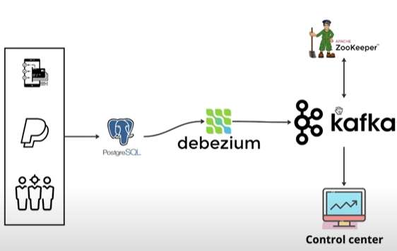

# Real-Time Data Capture Streaming 🚀

> Building efficient data pipelines with Docker, Postgres, Debezium, Kafka, and Control Center

[](https://www.docker.com/)
[](https://kafka.apache.org/)
[](https://www.postgresql.org/)
[](https://debezium.io/)
[](https://github.com/yourusername/Realtime-Data-Capture-Streaming)

## 📑 Table of Contents

- [Overview](#-overview)
- [System Architecture](#-system-architecture)
- [Development Journey](#-development-journey)
- [Getting Started](#-getting-started)
- [Interactive Demo](#-interactive-demo)
- [API Integration](#-api-integration)
- [Advanced Features](#-advanced-features)
- [Further Resources](#-further-resources)

## 🎯 Overview

This project implements a robust real-time data streaming pipeline that captures, processes, and visualizes data changes as they occur. Built over an intensive 2-day development sprint in June 2024, it demonstrates the power of combining modern data technologies to create responsive, scalable data systems.

The solution integrates multiple technologies:
- **PostgreSQL** for transactional data storage
- **Debezium** for change data capture (CDC)
- **Apache Kafka** for event streaming
- **Docker** for containerization and deployment
- **Control Center** for monitoring and management


*System architecture showing data flow from source to visualization*

## 🏗 System Architecture

The pipeline follows a modern event-driven architecture:

1. **Data Source**: PostgreSQL database stores transactional data
2. **Change Capture**: Debezium monitors database changes
3. **Event Streaming**: Kafka distributes change events
4. **Processing**: Stream processors transform events
5. **Visualization**: Real-time dashboards display insights

This design enables:
- **Decoupling** of data producers and consumers
- **Scalability** through distributed processing
- **Resilience** with message persistence
- **Real-time analytics** with minimal latency

## 🚀 Development Journey

This project represents a rapid learning and implementation process, completed in just 48 hours thanks to:

### 💡 Leveraging Previous Knowledge

- **SQL & Data Management**: Database design and query optimization
- **Web Development**: API design and frontend integration
- **Cyber Physical Systems**: Docker containerization and system architecture

### 🔍 Breadth-First-Search Learning Method

I adapted a "Breadth-First-Search" approach to research, quickly exploring multiple solutions before diving deep:

1. **Broad exploration** of potential technologies
2. **Quick assessment** of implementation challenges
3. **Focused learning** on chosen solution path
4. **Rapid prototyping** to validate concepts

This approach has proven effective across multiple projects, including:
- [Product Demand Prediction](https://github.com/mrjex/Product-Demand-Prediction)
- [Global City Streaming](https://github.com/mrjex/Global-City-Streaming)


## 🚀 Getting Started

### Prerequisites
- Docker and Docker Compose
- Python virtual environment

### Setup and Deployment

1. **Clone the repository**

2. **Enter virtual environment**
   ```bash
   python -m venv venv
   source venv/bin/activate  # Linux/Mac
   venv\Scripts\activate     # Windows
   ```

3. **Launch the system**
   ```bash
   docker-compose up -d
   ```

## 📊 Interactive Demo

### 1. Inserting New Data

Watch how new data instantaneously flows through the system:


*Real-time data insertion and propagation*

### 2. Updating Existing Records

Observe changes propagating through the pipeline:


*Live data updates flowing through the system*

## 💻 Database Interaction

### Accessing the Database

1. **Connect to PostgreSQL container**
   ```bash
   docker exec -it postgres /bin/bash
   ```

2. **Access the PostgreSQL CLI**
   ```bash
   psql -U postgres -d financial_db
   ```

### Common SQL Commands

| Command | Purpose | Example |
|---------|---------|---------|
| **SELECT** | View records | `SELECT * FROM transactions;` |
| **UPDATE** | Modify data | `UPDATE transactions SET amount = 1000 WHERE transaction_id = 'tx123';` |
| **INSERT** | Add records | `INSERT INTO transactions VALUES ('tx456', 'payment', 750.00, CURRENT_TIMESTAMP);` |

## 🔌 API Integration

For automated interaction, the system exposes RESTful endpoints:

### Creating a New Connector

```bash
curl -H 'Content-Type: application/json' localhost:8083/connectors --data '
{
  "name": "financial_connector",
  "config": {
    "connector.class": "io.debezium.connector.postgresql.PostgresConnector",
    "topic.prefix": "cdc",
    "database.user": "postgres",
    "database.dbname": "financial_db",
    "database.hostname": "postgres",
    "database.password": "postgres",
    "plugin.name": "pgoutput"
  }
}'
```

## 🎓 Advanced Features

The system includes several advanced capabilities:

- **Schema Evolution**: Gracefully handles database schema changes
- **Exactly-Once Semantics**: Ensures data integrity during processing
- **Fault Tolerance**: Continues operation even if components fail
- **Scalable Processing**: Handles increased data volumes through horizontal scaling


---

*Developed by Joel Mattsson in a 48-hour coding sprint*
